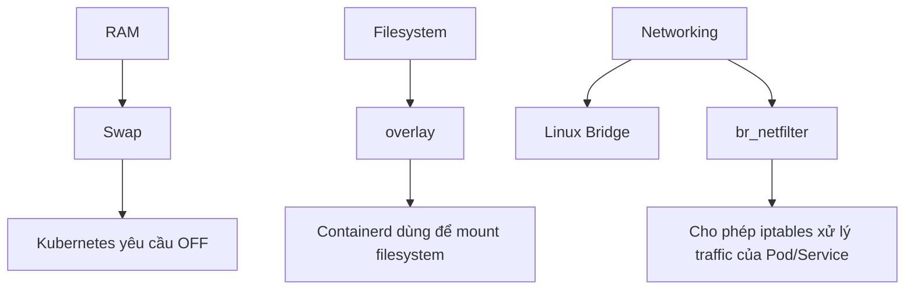

## Syllabus
### Domain 1: 
1. PV is cluster-scoped (no namespace). PVC is namespace-scoped
2. A PV is the actual storage (think: the hard drive). A PVC is a request for that storage (think: "I need 2Gi of disk"). A StorageClass tells Kubernetes how to dynamically create PVs when a PVC asks for one.
3. PVC binds to a PV when: capacity >= request, accessModes match, AND storageClassName matches. If any one of these is off, the PVC sits in Pending forever with no helpful error message.

**Access Modes** — know these four-letter abbreviations:

| Mode | Short | What it actually means |
| --- | --- | --- |
| ReadWriteOnce | RWO | One node can mount read-write. This is what you'll use 90% of the time. |
| ReadOnlyMany | ROX | Many nodes can mount read-only. Rarely comes up on the exam. |
| ReadWriteMany | RWX | Many nodes can mount read-write. Doesn't work with hostPath. |
| ReadWriteOncePod | RWOP | Only one pod can mount read-write. New in v1.29+, might show up. |

**Reclaim Policies** — know the difference or you'll lose data:

| Policy | What actually happens |
| --- | --- |
| Retain | The PV survives PVC deletion. Data is safe, but you must manually clean up the PV before it can be reused. |
| Delete | The PV and underlying storage are deleted. This is the default for most cloud StorageClasses. Be careful. |
| Recycle | Deprecated. Don't use it or memorize it. |

**Volume Modes:**

- **Filesystem** (default) — mounted as a directory.
- **Block** — a raw block device with no filesystem.

On the exam: know the difference between **Retain** and **Delete**. If the question says data should persist after PVC deletion, use **Retain**.

### Domain 2: Troubleshoots
1. Check container crashed: k logs <pod-name> --previous                 # crashed container — you'll use this a lot
2. Check certificated cluster expired: sudo kubeadm certs check-expiration

3. Check ETCD healthy: ETCDCTL_API=3 etcdctl endpoint health \
  --endpoints=https://127.0.0.1:2379 \
  --cacert=/etc/kubernetes/pki/etcd/ca.crt \
  --cert=/etc/kubernetes/pki/etcd/server.crt \
  --key=/etc/kubernetes/pki/etcd/server.key

4. ls /etc/kubernetes/manifests/  # Should have: etcd.yaml, kube-apiserver.yaml, kube-controller-manager.yaml, kube-scheduler.yaml

5. Troubleshoot Networking — Service not reachable? Work through this:

```bash
# 1. Does the service exist and have the right selector?
k get svc <service>
k describe svc <service>

# 2. Does the service have endpoints?
k get endpoints <service>
# If empty: selector doesn't match any running pod

# 3. Is the pod actually running on the target port?
k exec <pod> -- wget -qO- localhost:<port>

# 4. DNS working?
k run test-dns --image=busybox:1.36 --rm -it -- nslookup <service-name>

# 5. Is kube-proxy running?
k get pods -n kube-system -l k8s-app=kube-proxy

# 6. NetworkPolicy blocking traffic?
k get networkpolicy -n <namespace>
```

The most common networking issues on the exam:

- Service selector doesn't match pod labels (typo in labels)
- Service targetPort doesn't match container port
- NetworkPolicy denying traffic (remember: any policy = deny by default for that pod)
- CoreDNS down or misconfigured
- kube-proxy not running on a node

### Domain 3: Workloads, Scheduling
1. Deployments manage ReplicaSets, which manage Pods
2. ConfigMaps hold non-sensitive config. Secrets hold sensitive data (base64-encoded, not encrypted by default)
3. Three ways to inject ConfigMap/Secret into a pod:

- Env vars (all keys at once):

```yaml
envFrom:
- configMapRef:
    name: app-config
- secretRef:
    name: db-creds
```

- Single key as one env var:

```yaml
env:
- name: DATABASE_USER
  valueFrom:
    secretKeyRef:
      name: db-creds
      key: DB_USER
```

- Mounted as files (each key becomes a file in the mount path):

```yaml
volumeMounts:
- name: config-vol
  mountPath: /etc/config
volumes:
- name: config-vol
  configMap:
    name: app-config
```
4. If you set resource limits without requests, requests default to limits.
5. Schedule pods on specific nodes — three mechanisms:

- `nodeSelector` — simplest, exact label match:

```yaml
spec:
  nodeSelector:
    disk: ssd
```

- Node affinity — more flexible, supports expressions (`In`, `NotIn`, etc.):

```yaml
spec:
  affinity:
    nodeAffinity:
      requiredDuringSchedulingIgnoredDuringExecution:
        nodeSelectorTerms:
        - matchExpressions:
          - key: disk
            operator: In
            values:
            - ssd
```

- Taints (on nodes) + tolerations (on pods) — repels pods instead of attracting them:

```bash
k taint nodes node1 gpu=true:NoSchedule    # taint
k taint nodes node1 gpu=true:NoSchedule-   # remove
```

```yaml
spec:
  tolerations:
  - key: "gpu"
    operator: "Equal"
    value: "true"
    effect: "NoSchedule"
```

Effects: `NoSchedule` (block new pods) · `PreferNoSchedule` (soft avoid) · `NoExecute` (also evicts existing pods).
6. Static pods: cat /var/lib/kubelet/config.yaml | grep staticPodPath # Find the static pod path

### Domain 4 — Cluster Architecture, Installation & Configuration
1. RBAC has four objects:

| Object | Scope | Binds to |
|---|---|---|
| Role | Namespace | RoleBinding |
| ClusterRole | Cluster-wide | ClusterRoleBinding or RoleBinding |
| RoleBinding | Namespace | Role or ClusterRole |
| ClusterRoleBinding | Cluster-wide | ClusterRole |
2. Test permissions RBAC: k auth can-i list pods -n dev --as=system:serviceaccount:dev:my-sa
3. Use kubeadm to install a basic cluster:

```bash
# On control plane node:
sudo kubeadm init --pod-network-cidr=10.244.0.0/16

# Set up kubeconfig
mkdir -p $HOME/.kube
sudo cp /etc/kubernetes/admin.conf $HOME/.kube/config
sudo chown $(id -u):$(id -g) $HOME/.kube/config

# Install CNI (e.g., Calico)
k apply -f https://docs.projectcalico.org/manifests/calico.yaml

# On worker nodes:
sudo kubeadm join <control-plane-ip>:6443 --token <token> --discovery-token-ca-cert-hash sha256:<hash>
```

Lost the join command? Regenerate it: `kubeadm token create --print-join-command`
4. Node prerequisites — check in this order when a node won't join, `kubeadm init/join` fails, or kubelet won't start:

| Vấn đề | Kiểm tra | Cách sửa |
|---|---|---|
| Container runtime không chạy | `systemctl status containerd` | `systemctl start containerd` |
| Swap bật | `swapon --show` | `swapoff -a` |
| Thiếu module overlay | `lsmod \| grep overlay` | `modprobe overlay` |
| Thiếu module br_netfilter | `lsmod \| grep br_netfilter` | `modprobe br_netfilter` |
| Sai sysctl | `sysctl net.bridge.bridge-nf-call-iptables` | `sysctl -w net.bridge.bridge-nf-call-iptables=1` |

These are the most common OS-level misconfigurations the exam (or real environments) use to break node bootstrapping.


5. Upgrade on a Kubernetes Cluster Using Kubeadm 4.5
6. ETCD Backup Key difference: control plane uses kubeadm upgrade apply, worker uses kubeadm upgrade node
7. Where to find the cert paths: cat /etc/kubernetes/manifests/etcd.yaml and look for --cert-file, --key-file, --trusted-ca-file.

### Domain 5 - Services & Networking
1. Networking in Kubernetes "just works" if your CNI is installed correctly. Don't overthink the model — pods get IPs, pods can talk to each other, nodes can talk to pods. The CNI plugin (Calico, Flannel, Cilium) makes it happen
2. Same-node pods talk through a bridge, cross-node pods go through the CNI overlay
```bash
# Test pod-to-pod connectivity
k exec pod-a -- wget -qO- --timeout=2 http://<pod-b-ip>
```
3. The most important thing: port is what clients use to reach the service. targetPort is the port the container listens on. nodePort is the port on the node (NodePort/LoadBalancer only)
4. CoreDNS is the cluster DNS server (replaced kube-dns a long time ago). It runs as a Deployment in kube-system
5. Critical gotcha on the exam: if you add an Egress policy, you must also allow DNS (UDP 53). Otherwise the pod can't resolve any service names and everything looks broken even though the policy is "correct."

## Time Allocation

| Question Type | Typical Time | Notes |
| --- | --- | --- |
| Create a pod/deployment | 2-3 min | Use `$do` to generate YAML |
| Create RBAC resources | 3-5 min | Know the imperative commands |
| NetworkPolicy | 5-8 min | Always allow DNS egress |
| etcd backup/restore | 8-10 min | Know the cert paths |
| kubeadm upgrade | 8-10 min | Follow the sequence exactly |
| Troubleshoot broken node | 5-8 min | Check kubelet first |
| Troubleshoot networking | 5-8 min | Check endpoints, selectors |
| PV/PVC/StorageClass | 4-6 min | Match accessModes and storageClassName |
| DaemonSet | 3-4 min | Copy from docs fast |
| Ingress/Gateway | 4-6 min | Know ingressClassName |
| Static pod | 3-4 min | Write manifest directly to `/etc/kubernetes/manifests/` |
| Node drain/cordon | 2-3 min | `--ignore-daemonsets --delete-emptydir-data` |
